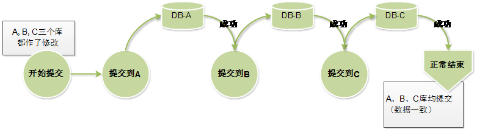

GeeQuery使用手册——Chapter-11  与Spring集成

[TOC]

# Chapter-11  与Spring集成

EF-ORM主要通过实现部分JPA接口和Spring集成。EF-ORM将被Spring认为是一个JPA实现一样提供支持。

## 11.1.  典型配置（快速入门） 

对于只想在自己的项目中快速使用EF-ORM，看本节就够了。后面的章节可以跳过。

本节内容适合于熟悉Spring事务管理机制的同学，在面对日常单个数据库连接时，可以直接使用下面的典型配置并自行修改。

~~~xml
<bean id="dataSource" class="jef.database.datasource.SimpleDataSource"
	p:url="jdbc:mysql://127.0.0.1:3306/cms?useUnicode=true" p:user="root" 
	p:password="12345"/>

<bean id="entityManagerFactory" class="org.easyframe.enterprise.spring.SessionFactoryBean">
	<property name="dataSource" ref="dataSource" />
</bean>
<bean id="commonDao" class="org.easyframe.enterprise.spring.CommonDaoImpl" />

<tx:annotation-driven transaction-manager="transactionManager" proxy-target-class="true" />
<aop:aspectj-autoproxy />
<context:component-scan base-package="com.company.my.application"/>
	
<bean id="transactionManager" class="org.springframework.orm.jpa.JpaTransactionManager">
	<property name="entityManagerFactory" ref="entityManagerFactory" />
	<property name="jpaDialect">
		<bean class="org.easyframe.enterprise.spring.JefJpaDialect" />
	</property>
</bean>
~~~

上面这段配置，数据源、SessionFactory、TransactionManager、基于注解的事务声明都有了。然后在编写一个自己的DAO——

~~~java
package com.company.my.application;

import org.easyframe.enterprise.spring.GenericDaoSupport;
@Repository
public class StudentDaoImpl extends GenericDaoSupport<Student> {
	public void gradeUp(Collection<Integer> ids) {
		Student st=new Student();
		st.getQuery().addCondition(Student.Field.id, Operator.IN, ids);
		st.prepareUpdate(Student.Field.grade, new JpqlExpression("grade+1"));
		try {
			//super.getSession()可以得到EF的Session对象
			getSession().update(st);
		} catch (SQLException e) {
			throw DbUtils.toRuntimeException(e);
		}
	}
} 
~~~

在Dao中，使用super.getSession()方法可以得到当前事务中的Session对象进行数据库操作。

在Service中，使用@Transactional注解进行事务控制。（请参阅Spring官方文档）

## 11.2.  配置和使用

### 11.2.1.  SessionFactory的配置 

前面的所有例子中，EF的核心对象是一个DbClient对象。DbClient里封装了所有的数据库连接和对应的ORM操作逻辑。

在JPA中，起到类似作用的对象是javax.persistence.EntityManagerFactory类，其地位就和某H框架的SessionFactory一样。

~~~xml
	<!-- 配置数据源，可以带连接池也可以不带 -->
	<bean id="dataSource" class="jef.database.datasource.SimpleDataSource"
		p:url="${db.url}" p:username="${db.user}" p:password="${db.password}" />

	<bean id="entityManagerFactory" class="org.easyframe.enterprise.spring.SessionFactoryBean">
		<property name="dataSource" ref="dataSource" />
	</bean>
	<bean id="commonDao" class="org.easyframe.enterprise.spring.CommonDaoImpl" />
~~~

​					 代码 11-1 单数据源的EntityManagerFactory配置 

上面的配置中，用Spring的FactoryBean创建EntityManagerFactory对象。EntityManagerFactory是JPA规范中的数据操作句柄。其类似于某H框架和某batis的SessionFactory。

上面的配置，除了定义了EntityManagerFactory对象以外，还定义一个CommonDao对象，该对象实现了org.easyframe.enterprise.spring.CommonDao接口。其作用是仿照传统Dao习惯，提供一个能完成基本数据库操作的对象。具体用法参见11.1.4节。

org.easyframe.enterprise.spring.SessionFactoryBean这个Bean支持以下的配置参数：

| 参数                              | 用途                                       | 备注或示例                                    |
| ------------------------------- | ---------------------------------------- | :--------------------------------------- |
| dataSource                      | 指定一个数据源。                                 | javax.sql.DataSource的子类即可。               |
| dataSources                     | map类型，指定多个数据源                            | \<property  name="dataSources">  \<map> \<entry  key="ds1" value-ref="ds1" />\<entry  key="ds2" value-ref="ds2" /> \</map>                                                                                                         \</property> |
| defaultDatasource               | 多数据源时，指定缺省数据源                            | \<property  name="defaultDatasource" value="ds1"> |
| packagesToScan                  | 配置包名，启动时会扫描这些包下的所有实体类并加载。                | \<property  name="packageToScan">\<list>      \<value>org.easyframe.test\</value>      \<value>org.easyframe.entity\</value>   \</list>\</property> |
| annotatedClasses                | 配置类名，启动时会扫描这些类并加载                        | \<property  name="annotatedClasses">\<list>   \<value>org.easyframe.testp.jta.Product\</value>   \<value>org.easyframe.testp.jta.Users\</value>   \</list>\</property> |
| createTable                     | boolean类型。当扫描到实体后，如果数据库中不存在，是否建表         | 默认true，可以关闭  \<property  name="createTable" value="false" /> |
| alterTable                      | boolean类型。当扫描到实体后，如果数据库中存在，是否修改表         | 默认true，可以关闭  \<property  name="alterTable" value="false" /> |
| allowDropColumn                 | boolean类型。当扫描到实体后，如果数据库中存在并且需要修改时，是否可以删除列 | 默认false，可以开启  \<property  name="allowDropColumn" value="true" /> |
| enhancePackages                 | 配置包名，启动时先对指定包下的实体进行一次增强，多个包用逗号分隔。        | 扫描增强只能对目录下的class文件生效，对ear/war/jar包中class无效。由于大部分J2EE容器都支持包方式部署，此功能只建议在单元测试时使用，不建议发布class未增强的包。  \<property  name="enhancePackages" value="org.easyframe.tutorial"  /> |
| dynamicTables                   | 配置数据库表名，启动时扫描这些表，生成动态表模型。表名之间逗号分隔        | 参见动态表相关功能说明。  \<property  name="dynamicTables" value="EF_TABLE1,XX_TABLE2,TABLE3"  /> |
| registeNonMappingTableAsDynamic | 对比当前数据库中存在的表，如果数据库中的表并未被任何实体所映射，那么生成这张表的动态表模型。 | 该功能可以将所有未被映射的表当做动态表，建立对应的动态元模型，参见动态表相关功能说明。默认false  \<property  name="registeNonMappingTableAsDynamic" value="true" /> |

### 11.2.2.  多数据源的配置

前面提到EF-ORM原生支持分库分表，分库分表意味着EF-ORM要能支持多个数据库实例。

最简单的多数据库下的配置如下

~~~xml

	<!-- 配置多个数据源的DataSource，可以配置带连接池的DataSource，也可以配置不带连接池的DataSource
      甚至可以混合使用（没必要的情况下不建议这么做） -->
	<bean id="dataSource-1" class="jef.database.datasource.SimpleDataSource"
		p:url="${db.url}" p:username="${db.user}" p:password="${db.password}" />
	<bean id="dataSource-2" class="com.alibaba.druid.pool.DruidDataSource"
		destroy-method="close" 
		p:driverClassName="${db.driver2}"
		p:url="${db.url2}" 
		p:username="${db.user2}"
		p:password="${db.password2}" 
		p:initialSize=3 
		p:minIdle=1 
		p:maxIdle=20
		p:maxActive=50
		/>
	<bean id="dataSource-3" class="org.apache.commons.dbcp.BasicDataSource"
		destroy-method="close" 
		p:driverClassName="${db.driver3}"
		p:url="${db.url3}" 
		p:username="${db.user3}"
		p:password="${db.password3}" 
		p:initialSize=3 
		p:minIdle=1 
		p:maxIdle=20
		p:maxActive=50 
		/>
	<bean id="routingDS" class="jef.database.datasource.RoutingDataSource">
		<property name="dataSourceLookup">
			<bean class="jef.database.datasource.SpringBeansDataSourceLookup" />
		</property>
	</bean>

	<bean id="entityManagerFactory" class="org.easyframe.enterprise.spring.SessionFactoryBean">
		<property name="dataSource" ref="routingDS" />
	</bean>
	<bean id="commonDao" class="org.easyframe.enterprise.spring.CommonDaoImpl" />
~~~

 						代码 11-2 多数据源的EntityManagerFactory配置

多数据库下，需要声明一个RoutingDataSource对象。而RoutingDataSource中，可以配置一个DataSourceLookup对象。DataSourceLookup对象提供多个真正的数据源，通过配置不同的DataSourceLookup，可以实现从不同的地方读取数据源。

上面的配置方法中，定义了***dataSource-1,dataSource-2,dataSource-3***三个原始数据源，存放在Spring的ApplicationContext中。而对应的DataSourceLookup对象是SpringBeansDataSourceLookup，该对象可以从Spring上下文中查找所有的DataSource对象。

框架提供了多个DataSourceLookup，用于在从不同的地方读取数据源配置，默认的数据源获取器包括以下四种。

* **DbDataSourceLookup**

到数据库里去取数据源的配置信息。以此进行数据源的查找。

如果利用一个配置库来维护其他各种数据库的连接信息，那么系统会到这个数据库中去寻找数据源。数据库中配置数据源的表和其中的列名也可以配置。参见下面的示例。

~~~xml
<bean class="jef.database.datasource.DbDataSourceLookup"
 	p:configDataSource-ref="dataSource" 
 	p:configDbTable="DATASOURCE_CONFIG"
 	p:whereCondition="enable='1'"
 	p:columnOfId="DATABASE_NAME"
 	p:columnOfUrl="JDBC_URL"
 	p:columnOfUser="DB_USER"
 	p:columnOfPassword="DB_PASSWORD"
 	p:columnOfDriver=""
 	p:datasourceIdOfconfigDB="" 
 	p:defaultDsName="" >
 	 <property name="passwordDecryptor">
 		  <!-- 自定义的数据库口令解密器 -->
		   <bean class="org.googlecode.jef.spring.MyPasswordDecryptor" />
	  </property>
 </bean>	
~~~

 使用上述配置，即可在需要数据库连接信息时，通过数据库查找去获取数据库连接配置。

* **JndiDatasourceLookup**

  到JNDI上下文去找寻数据源配置。参见下面的示例。

~~~xml
<bean class="jef.database.datasource.JndiDatasourceLookup"></bean>	
~~~

使用上述配置，即可在需要数据库连接信息时，通过JNDI查找去获取数据库连接配置。

* **MapDataSourceLookup**

 从一个固定的Map对象中获取已经配置的数据源信息。在我们的一些示例代码中，有些直接就用Map来传入数据源配置。

~~~java
// 准备多个数据源
Map<String, DataSource> datasources = new HashMap<String, DataSource>();
datasources.put("datasource1", new SimpleDataSource("jdbc:derby:./db;create=true", null, null));
datasources.put("datasource2", new SimpleDataSource("jdbc:derby:./db2;create=true", null, null));
datasources.put("datasource3", new SimpleDataSource("jdbc:derby:./db3;create=true", null, null));
MapDataSourceLookup lookup = new MapDataSourceLookup(datasources);
lookup.setDefaultKey("datasource1");// 指定datasource1是默认的操作数据源
// 构造一个带数据路由功能的DbClient
db = new DbClient(new RoutingDataSource(lookup));
~~~

在Spring配置中也可以用Map来传入多个数据源。如下示例：

```xml
<bean id="mapLookup" class="jef.database.datasource.MapDataSourceLookup">
	<property name="datasources">
		<map>
			<entry key="ds1" value-ref="dataSource" />
			<entry key="ds2" value-ref="dataSource2" />
			<entry key="ds3" value-ref="dataSource2" />
		</map>
	</property>
</bean>
```

* **SpringBeansDataSourceLookup**

  从Spring上下文中获取所有数据源信息。一般不用添加参数，配置完成后SpringContext中所有类型为DataSource的Bean都会作为数据源。

配置如下：

~~~xml
<bean name="ds1" class="package.XxxDataSource" />
<bean name="ds2" class="package.XxxDataSource" />
<!-- 以上可配置多个数据源 -->
<bean name="multi-datasource" class="jef.database.datasource.SpringBeansDataSourceLookup" />
<!-- 使用SpringBeansDataSourceLookup来整合多个DataSource bean-->
~~~

上面提到的是EF提供的几种默认的DataSourceLookup，开发者也可以编写自己的DataSourceLookup。 

 ### 11.2.3.  JPA事务配置

大家都知道，Spring有七种事务传播级别。因为标准JPA只能支持其中六种，因此EF-ORM提供了相关的JPA方言以支持第七种。其中nested方式需要JDBC驱动支持SavePoint.

~~~xml
	<bean id="transactionManager" class="org.springframework.orm.jpa.JpaTransactionManager">
		<property name="entityManagerFactory" ref="entityManagerFactory" />
		<property name="jpaDialect">
			<bean class="org.easyframe.enterprise.spring.JefJpaDialect" />
		</property>
	</bean>

	<tx:annotation-driven transaction-manager="transactionManager" proxy-target-class="true" />
	<aop:aspectj-autoproxy />
~~~

                    					**代码 11-3 Spring基于注解的声明式事务配置方法**

Spring的事务配置有好多种方法，上面这种是纯注解的声明式事务，另一种流行的AOP拦截器配置方法如下

~~~xml
	<bean id="transactionManager" class="org.springframework.orm.jpa.JpaTransactionManager">
		<property name="entityManagerFactory" ref="entityManagerFactory" />
		<property name="jpaDialect">
			<bean class="org.easyframe.enterprise.spring.JefJpaDialect" />
		</property>
	</bean>
	<tx:advice id="tx-advice-default transaction-manager="transactionManager">
		<tx:attributes>
			<tx:method name="*" propagation="REQUIRED" />
		</tx:attributes>
	</tx:advice>
	<tx:advice id="tx-always-new" transaction-manager="transactionManager">
		<tx:attributes>
			<tx:method name="*" propagation="REQUIRES_NEW" />
		</tx:attributes>
	</tx:advice>
    <aop:config>
        <aop:pointcut id="interceptorPointCuts"
            expression="execution(* com.company.product.dao.*.*(..))" />
        <aop:advisor advice-ref="tx-advice-defaul"
            pointcut-ref="interceptorPointCuts" />        
    </aop:config>
~~~

​				 	**代码 11-4  Spring基于AOP拦截器的声明式事务配置方法**

Spring事务配置方法还有很多种，但不管哪种配置方法，和ORM框架相关的就只有**“transactionManager”**对象。其他配置都只和Spring自身的事务实现机制有关。

上面的TransactionManager的配置方法和标准的JPA事务管理器配置方法区别之处在于，指定了一个jpaDialect对象，这是因为标准JPA实现因为接口和方法功能较弱，不足以实现Spring事务控制的所有选项。因此Spring提供了一种手段，由ORM提供一个事务控制的方言，Spring根据方言可以精确控制事务。JefJpaDialect的增加，使得EF-ORM能够支持Spring的事务管理的以下特性。（这些特性是标准JPA接口无法支持的)

| Spring配置                 | **在Spring中的作用**                          | **效果**                                   |
| ------------------------ | ---------------------------------------- | ---------------------------------------- |
| **Propagation=“nested”** | Spring的7种事务传播级别之一,NESTED方法是启动一个和父事务相依的子事务，因为不是EJB标准的，因此JPA不支持。 | 由于标准JPA接口中无SavePoint操作，因此无法支持NESTED传播行为，EF-ORM在JpaDIalect中支持了SavePoint，因此可以使用NESTED传播行为。  再加上JPA本身支持的其他6种传播行为，EF-ORM可以支持全部7种传播行为。 |
| **isolation**            | 定义事务的四种隔离级别。                             | JPA接口不提供对数据库事务隔离级别的动态调整。也就无法支持Spring的事务隔离级别。但EF-ORM可以支持。 |
| **read-only="true"**     | 指定事务为只读。该属性提示ORM框架和JDBC驱动进行优化，比如Hibernate下只读事务可以省去flush缓存操作。Oracle服务器原生支持readonly级别，可以不产生回滚段，不记录重做日志，甚至可以提供可重复读等特性。 | 在只读模式下，EF-ORM将对JDBC Connection进行readOnly进行设置，从而触发数据库和驱动的只读优化。当然并不是所有的数据库都支持只读优化。 |
| **timeout**              | 事务超时时间，事务一旦超时，会被标记为rollbackOnly，抛出异常并终止处理。 | JPA原生接口不提供事务超时控制。EF-ORM可以通过方言支持。         |

### 11.2.4.  编写DAO

通过上面两节，我们在Spring中提供了EntityFactoryManager和事务管理。接下来就是编写自己的Dao对象了。EF-ORM提供了一个泛型DAO实现。

####*  继承GenericDaoSupport

   EF-ORM提供了一个泛型的DAO实现。

* 接口类为org.easyframe.enterprise.spring.GenericDao\<T>


* 实现类为org.easyframe.enterprise.spring.GenericDaoSupport\<T>

开发者的DAO可以直接继承GenericDaoSupport类。

orm-tutorial\src\main\java\org\easyframe\tutorial\lessonb\StudentDao.java

~~~java
/**
 * 这个类实现了GenericDao<T>接口
 */
public class StudentDao extends GenericDaoSupport<Student>{

}
~~~

继承GenericDaoSupport后，该DAO就已经有了各种基本的持久化操作方法。

 

如果需要自行添加方法，可以这样做

接口orm-tutorial\src\main\java\org\easyframe\tutorial\lessonb\StudentDao.java

~~~java
public interface StudentDao extends GenericDao<Student>{
	/**
	 * 批量升级学生
	 * @param ids
	 */
	public void gradeUp(Collection<Integer> ids);
}
~~~

实现类orm-tutorial\src\main\java\org\easyframe\tutorial\lessonb\StudentDaoImpl.java

~~~java
public class StudentDaoImpl extends GenericDaoSupport<Student> implements StudentDao{
	public void gradeUp(Collection<Integer> ids) {
		Student st=new Student();
		st.getQuery().addCondition(Student.Field.id, Operator.IN, ids);
		st.prepareUpdate(Student.Field.grade, new JpqlExpression("grade+1"));
		try {
			getSession().update(st);
		} catch (SQLException e) {
			throw DbUtils.toRuntimeException(e);
		}
	}
}
~~~

对于自行实现的方法，可以使用继承自BaseDao类的方法获得Session对象。

一般来说，GenericDao中已经包含了绝大多数日常所需的数据库操作。如果没有特殊操作，我们甚至不需要为某个Bean创建DAO，而是使用后文的CommonDao即可。    

####*  继承BaseDao

GenericDao继承了BaseDao。开发者也可以直接继承org.easyframe.enterprise.spring.BaseDao类来编写DAO。在DAO中，开发者可以使用标准的 JPA 方法来实现逻辑，也可以使用EF-ORM的Session对象来实现逻辑。

 orm-tutorial\src\main\java\org\easyframe\tutorial\lessonb\MyDao.java

~~~java
public class MyDao extends BaseDao{
	
	/**
	 * 使用标准JPA的方法来实现DAO
	 */
	public Student loadStudent(int id){
		return getEntityManager().find(Student.class, id);
	}
	
	/**
	 * 使用EF-ORM的方法来实现DAO
	 * @param name
	 * @return
	 */
	public List<Student> findStudentByName(String name){
		Student st=new Student();
		st.getQuery().addCondition(QB.matchAny(Student.Field.name, name));
		try {
			return getSession().select(st);
		} catch (SQLException e) {
			throw DbUtils.toRuntimeException(e);
		}
	}
}
~~~

BaseDao基类中提供了以下方法

| 方法                 | 作用                                  | 说明                                       |
| ------------------ | ----------------------------------- | ---------------------------------------- |
| getEntityManager() | 得到javax.persistence.EntityManager对象 | EntityManager是JPA中操作持久化对象的主要方式。          |
| getSession()       | 得到jef.database.Session对象            | Session对象是EF-ORM操作数据库的基本类。前面所有例子中的DbClient和Transaction都是其子类。 |
| getDbClient()      | 得到jef.database.DbClient对象           | 不建议使用。DbClient对象是无事务状态的Session。对其进行的任何操作都是直接提交到数据库的，不在Spring事务控制之下。 |

要注意的是 getEntityManager()中得到的JPA对象javax.persistence.EntityManager中，EF-ORM并没有实现其全部方法。其中CriteriaBuilderCriteriaQuery相关的功能都会抛出UnSupportedOperationException.这部分功能请使用EF-ORM自己的Criteria API。

### 11.2.5.  常用API: CommonDao

EF-ORM提供了CommonDao是基于Spring的Dao bean的通用接口，提供了以下方法(此处仅列举，详细请参阅API-DOC)

由于EF-ORM中的Entity可以携带Query对象，表示复杂的where条件和update条件，因此很多看似简单的接口，实际上能传入相当复杂的SQL查询对象，请不要低估其作用。

| **方法**                                   | **备注**                                   |
| ---------------------------------------- | ---------------------------------------- |
| **基础的查询、插入、更新、删除方法**                     |                                          |
| T insert(T entity);                      | 相当于session.insert                        |
| void remove(Object entity);              | 相当于session.delete()  支持单表CriteriaAPI     |
| int update(T entity);                    | 相当于session.update()  支持单表CriteriaAPI     |
| List\<T> find(T data);                   | 相当于session.select()  支持单表CriteriaAPI     |
| T load(T data);                          | 相当于session.load()  支持单表CriteriaAPI       |
| \<T> ResultIterator\<T> iterate(T obj);  | 相当于session.iteratedSelect()  支持单表CriteriaAPI |
| **byProperty/  byKey系列**                 |                                          |
| void removeByProperty(ITableMetadata meta, String propertyName,  List<?> values); | 指定一个字段为条件，批量删除。                          |
| int removeByKey(ITableMetadata meta,String field,Serializable  key); | 指定一个字段为条件，单次删除                           |
| int removeByKey(Class\<T> meta,String field,Serializable  key); | 指定一个字段为条件，单次删除                           |
| T loadByKey(Class\<T> meta,String field,Serializable key); | 指定一个字段为条件，加载单条                           |
| T loadByKey(ITableMetadata meta,String field,Serializable id); | 指定一个字段为条件，加载单条                           |
| List<?> findByKey(ITableMetadata meta, String  propertyName, Object value); | 指定一个字段为条件，加载多条                           |
| **ByExample系列**                          |                                          |
| List\<T> findByExample(T entity,String... properties); | 传入模板bean，可指定字段名，这些字段值作为where条件           |
| int removeByExample(T entity,String... properties); | 传入模板bean，可指定字段名，这些字段值作为where条件           |
| **By  PrimaryKey **                      |                                          |
| T loadByPrimaryKey(ITableMetadata meta, Object id); | 按主键加载                                    |
| T loadByPrimaryKey(Class\<T> entityClass, Object  primaryKey); | 按主键加载                                    |
| **保存方法**                                 |                                          |
| void persist(Object entity);             | 对象存在时更新，不存在时插入                           |
| T merge(T entity);                       | 对象存在时更新，不存在时插入                           |
| **Update方法**                             |                                          |
| int updateByProperty(T entity,String... property); | 可传入多个字段名，这些字段的值作为where条件                 |
| int update(T entity,Map\<String,Object> setValues,String...  property); | 可传入多个字段名，这些字段的值作为where条件。可在map中指定要更新的值。  |
| **Remove方法**                             |                                          |
| void removeAll(ITableMetadata meta);     | 删除全表记录                                   |
| **批量操作系列**                               |                                          |
| int batchUpdate(List\<T> entities);      | 批量（按主键）更新                                |
| int batchUpdate(List\<T> entities,Boolean doGroup); | 批量（按主键）更新                                |
| int batchRemove(List\<T> entities);      | 批量删除                                     |
| int batchRemove(List\<T> entities,Boolean doGroup); | 批量删除                                     |
| int batchInsert(List\<T> entities);      | 批量插入                                     |
| int batchInsert(List\<T> entities,Boolean doGroup); | 批量插入                                     |
| **命名查询NamedQuery**                       |                                          |
| List\<T> findByNq(String nqName, Class\<T>  type,Map\<String, Object> params); | 传入查询名称、返回类型、参数                           |
| List\<T> findByNq(String nqName, ITableMetadata  meta,Map\<String, Object> params); | 传入查询名称、返回类型、参数                           |
| int executeNq(String nqName,Map\<String,Object> params); | 执行命名查询操作，传入查询名称，参数。                      |
| **E-SQL操作系列**                            |                                          |
| List\<T> findByQuery(String sql,Class\<T> retutnType,  Map\<String, Object> params); | 传入E-SQL语句查询结果                            |
| List\<T> findByQuery(String sql,ITableMetadata retutnType,  Map\<String, Object> params); | 传入E-SQL语句，查询结果                           |
| int executeQuery(String sql,Map\<String,Object> param); | 传入E-SQL语句，执行                             |
| \<T> ResultIterator\<T> iterateByQuery(String  sql,Class\<T> returnType,Map\<String,Object> params); | 传入E-SQL语句。查询并以遍历器返回。                     |
| \<T> ResultIterator\<T> iterateByQuery(String sql,  ITableMetadata returnType, Map\<String, Object> params); | 传入E-SQL语句。查询并以遍历器返回。                     |
| **分页查询方法**                               |                                          |
| Page\<T> findAndPage(T data,int start,int limit); | 传入单表Criteria对象。分页查询                      |
| Page\<T> findAndPageByNq(String nqName, Class\<T>  type,Map\<String, Object> params, int start,int limit); | 传入命名查询名称，分页查询                            |
| Page\<T> findAndPageByNq(String nqName, ITableMetadata  meta,Map\<String, Object> params, int start,int limit); | 传入命名查询名称，分页查询                            |
| Page\<T> findAndPageByQuery(String sql,Class\<T>  retutnType, Map\<String, Object> params,int start,int limit); | 传入E-SQL语句，分页查询                           |
| Page\<T> findAndPageByQuery(String sql,ITableMetadata  retutnType, Map\<String, Object> params,int start,int limit); | 传入E-SQL语句，分页查询                           |
| **其他**                                   |                                          |
| Session getSession();                    | 得到的EF-ROM Session对象                      |
| DbClient getNoTransactionSession();      | 得到当前无事务的操作Session                        |

从上面的API可以看出，配置命名查询配置，仅凭CommonDao已经可以完成大部分的数据库DAO操作。

>​	**DAO轻量化实践**
>
>​	*从个人开发实践看，随着ORM**框架封装性的提升，DAO**层越来越趋向轻量化。这里是个人的一点看法和建议。*
>
>​	*轻量化表现在*
>
>​	*1.在无需多种实现的情况下，DAO**无须设计接口类*
>
>​	*2. 无需为每个Entity创建DAO，大多数数据库操作在Service中直接获取CommonDao进行操作即可。*
>
>​	*为什么说，为每个Entity创建一个DAO这种做法过时了呢？*
>
>​	*实践表明，局限单表的操作都可以继承GenericDao自动获得，子类中几乎无需任何编码，甚至泛型都是不需要的，ORM能够根据传入的对象类型绑定到对应的数据表上。所以泛型的DAO仅仅是起到了增加了一些Bean类型校验的作用。为此付出的代价是，开发时还要控制不同DAO的依赖注入、还要控制bean使用对号入座的DAO**进行操作，这些都是多余的工作。*
>
>​	*此外，如果我们为每个Entity创建DAO，那么多表关联的操作应该放在哪个DAO里呢？ 事实上无论放在哪一个DAO中都不是那么合理的。*
>
>​	*所以，结合业务实践，个人建议在使用EF-ORM的时候，可以省略掉大部分Entity的对应的DAO。一些复杂数据库操作（基本上是涉及多表的），可以自行继承CommonDaoImpl，放在公共的DAO中。一般中小规模的应用，最后的DAO个数不会超过10个*

### 11.2.6.  POJO操作支持

CommonDao中的方法还有一个特点，那就是可以支持POJO Bean。我们在最初的1.1.3示例中可以发现，无需继承jef.database.DataObject，我们可以直接使用单纯的POJO对象创建表、删除表、执行CRUD操作。

POJO支持是为了进一步简化ORM使用而在CommonDao中进行的特殊处理。因此CommonDao中所有的泛型T，都无需继承jef.database.DataObject。

 当我们定义POJO时，依然可以使用 @Id @Column @Table等基本的JPA注解。不过由于POJO Bean中不包含Query对象，因此在使用上基本只能按主键实现CRUD操作。

CommonDao中设计了xxxxByProperty、xxxxByKey等系列的方法，也正是考虑到POJO对象中，无法准备的记录用户设置过值的字段，因此提供一个手工指定的补救办法。使用这两个系列的方法，可以更方便的操作POJO对象。例如

我们定义一个POJO Entity

orm-tutorial\src\main\java\org\easyframe\tutorial\lessonb\entity\Foo.java

~~~java
@Table(name="MY_FOO")
public class Foo {
	@Id
	@GeneratedValue
	private int id;
	private String name;
	private int age;
//Getter Setter省略
}
~~~

便可以对其进行各种操作了

~~~java
	@Test
	public void test1() throws SQLException{
		commonDao.getNoTransactionSession().dropTable(Foo.class);
		commonDao.getNoTransactionSession().createTable(Foo.class);
		{
			Foo foo=new Foo();
			foo.setName("Hello!");
			commonDao.insert(foo);	
		}
		{
			Foo foo=new Foo();
			foo.setAge(3);
			foo.setName("飞");
			//update MY_FOO set age=3 where name='Hello!'
			commonDao.updateByProperty(foo, "name");
		}
		{
			Foo foo=commonDao.loadByPrimaryKey(Foo.class, 1);
			System.out.println(foo.getName());
		}
		{
			//根据ID删除
			commonDao.removeByKey(Foo.class, "id", 1);
		}
	}
~~~

上面演示了对Foo对象进行建表、删表、增删改查操作。

最后，EF-ORM可以在一定程度上识别某H框架的配置文件，当做POJO Bean的注解来使用。这种做法可以在EF-ORM中直接使用某H框架的Bean定义。

比如我们创建不带任何注解的POJO类

orm-tutorial\src\main\java\org\easyframe\tutorial\lessonb\entity\PojoEntity.java

~~~java
public class PojoEntity {
	private String name;
	private Integer id;
	private String comments;
     //Getter Setter
}
~~~

然后我们配置一个XML文件去定义这个类的元数据

orm-tutorial\src\main\java\org\easyframe\tutorial\lessonb\entity\hbm\PojoEntity.hbm.xml

~~~xml
<?xml version="1.0" encoding="UTF-8"?>
<!DOCTYPE hibernate-mapping PUBLIC "-//Hibernate/Hibernate Mapping DTD 3.0//EN"
"http://www.hibernate.org/dtd/hibernate-mapping-3.0.dtd">
<hibernate-mapping>
	<class name="org.easyframe.tutorial.lessonb.entity.PojoEntity" table="Jef_pojo_table">
		<id name="id">
			<column name="id" length="5" />
			<generator strategy="IDENTITY" />
		</id>
		<property name="name">
			<column name="name" />
		</property>
		<property name="comments">
			<column name="comments" />
		</property>
	</class>
</hibernate-mapping>
~~~

只要通过指定class和某xml文件存在关联，EF-ORM就能够识别某H框架中的主要标签来读取元数据配置。

orm-tutorial\src\main\java\org\easyframe\tutorial\lessonb\Case1.java

~~~java
@Test
public void test2() throws SQLException{
	//读取指定路径下的某H框架配置文件。 %s表示类的SimpleName。%c表示类的全名。
	ORMConfig.getInstance().setMetadataResourcePattern("hbm/%s.hbm.xml");

	commonDao.getNoTransactionSession().dropTable(PojoEntity.class);
	commonDao.getNoTransactionSession().createTable(PojoEntity.class);
		
	PojoEntity p=new PojoEntity();
	p.setName("fsdfsfs");
		
	commonDao.insert(p);
	System.out.println(p.getId());
	commonDao.insert(p);
	System.out.println(p.getId());
	commonDao.insert(p);
	System.out.println(p.getId());
		
		
	PojoEntity pojo=commonDao.load(p);
	System.out.println(pojo);
		
	pojo.setName("35677");
	commonDao.update(pojo);
		
	System.out.println("===========================");
		
	PojoEntity cond=new PojoEntity();
	cond.setId(12);
	System.out.println(commonDao.find(cond));
	commonDao.remove(cond);
}
~~~

有一项名为MetadataResourcePattern的全局参数配置，用于指定Entity类和某个XML文件之间的关联关系。

例如，所有的XML文件位于class path下的 /hbm目录中，其名称和类的SimpleName一致。此时可以在jef.properties中配置——

~~~properties
metadata.resource.pattern=/hbm/%s.hbm.xml
~~~

其中 %s表示类的SimpleName；%c表示类的全名；

还可以用 %\*表示匹配任意字符，一旦匹配为*，那么EF-ORM会查找所有满足条件的XML，然后根据XML中配置的class属性反向匹配到Entity上。

目前此功能仅支持某H框架中一些基本的单表字段描述，级联等描述目前还不支持。

## 11.3.  多数据源下的事务控制

在数据分库之后。下一个问题就接踵而至，这就是分布式事务的一致性问题。

如果我们依旧使用Spring的JPA事务控制器，正常情况下，如果所有数据库都成功提交，那么事务可以保持一致，如下图所示------

 

### 11.3.1.  JPA事务（多重）

如果考虑到提交可能失败的场景，我们如果继续使用JPA事务管理器，我们将需要承担一定的风险。

**中断提交**

当遭遇提交失败时，有两种行为策略。默认的是“中断提交”

因此，在默认情况下，当一个Spring事务结束时，EF会顺序提交A、B两个数据库的修改。如果发生提交失败，则中断提交任务。

 


从上例看，也就是说，如果先提交 A库失败，那么A、B库都不提交。如果先提交A库成功，B库提交失败，那么A库的修改将会生效，而B库的修改不生效。

**继续提交**

此外，这一策略还可以变更。在jef.properties中配置：

~~~properties
db.jpa.continue.commit.if.error =true
~~~

开启上述配置后，那么在一个库提交失败后，整个提交过程将持续进行下去，直到所有能提交的变更都写入数据库位置。这种策略下，哪个连接先提交哪个后提交将不再产生影响。如下图所示  

 

这种方式下，简单来说，如果我们的事务中用到了A、B两个数据库，事务提交时A、B数据库的修改单独提交，互不影响。

无论使用上述哪种策略，都有可能会出现某些数据库提交成功、某些数据库提交失败的可能。因此，在没有跨库事务一致性要求的场合，我们依然可以用JPATransactionManager来管理事务，虽然这可能会造成上述两种场景的数据不一致，但如果您的系统业务上本身就没有这种严格的一致性要求时，JPA事务不失为是最简单的使用方法。

在多库上使用JPA事务管理器时，每个数据库上的操作分别位于独立的事务中，相当于将Spring的事务划分为了多个独立的小型JPA事务。我们姑且用 “多重JPA事务”来称呼。

​	如果出现了某些数据库被提交，某些数据库出错或未提交。此时框架将会抛出*jef.database.innerpool.InconsistentCommitException类。*该异常类标识着多个数据库的提交状态出现了不一致。该异常类中，可以获得哪些数据源提交成功，哪位未提交成功的信息。供开发者自行处理。

### 11.3.2.  JTA事务支持

上面的问题是不是无法避免的呢？不是， SpringFramework还支持JTA事务。使用J2EE的JTA规范，我们可以让EF-ORM在多数据库下支持分布式事务。

JTA是JavaEE技术规范之一，JTA允许应用程序执行分布式事务处理——在两个或多个网络计算机资源上访问并且更新数据。EF-ORM可以借助一些数据库JDBC驱动本身的XA功能，或者第三方的开源JTA框架实现分布式事务。

使用JTA事务后，刚才的流程即可变为下图所示，因此任何一个数据库提交错误情况下，都能确保数据库数据一致性。

 

 目前ef-orm推荐使用atomikos作为JTA的事务支持框架。

关于JTA的介绍，可参见http://www.ibm.com/developerworks/cn/java/j-lo-jta/

关于atomikos的介绍，可参见[http://www.atomikos.com/](http://www.atomikos.com/)

下面我们举例，用Spring + atomikos + EF-ORM实现分布式事务。
首先，我们在pom.xml中，引入atomikos的包以及jta的API包。

~~~xml
	<dependency>
		<groupId>com.atomikos</groupId>
		<artifactId>transactions-jdbc</artifactId>
		<version>3.9.3</version>
	</dependency>
	<dependency>
		<groupId>com.atomikos</groupId>
		<artifactId>transactions-jta</artifactId>
		<version>3.9.3</version>
	</dependency>
	<dependency>
		<groupId>javax.transaction</groupId>
		<artifactId>jta</artifactId>
		<version>1.1</version>
	</dependency>
~~~

由于使用了atomikos，在Spring bean配置中，需要配置XA的数据源

~~~xml
<bean id="ds1" class="com.atomikos.jdbc.AtomikosDataSourceBean"
		init-method="init" destroy-method="close">
		<property name="uniqueResourceName"><value>mysql/ds1</value>	</property>
		<property name="xaDataSourceClassName">
			<value>com.mysql.jdbc.jdbc2.optional.MysqlXADataSource</value>
		</property>
		<property name="xaProperties">
			<props>
				<prop key="URL">jdbc:mysql://localhost:3307/test</prop>
				<prop key="user">root</prop>
				<prop key="password">admin</prop>
			</props>
		</property>
		<property name="poolSize"><value>3</value></property>
		<property name="maxPoolSize"><value>30</value>	</property>
	</bean>
	<bean id="ds2" class="com.atomikos.jdbc.AtomikosDataSourceBean"
		init-method="init" destroy-method="close">
		<property name="uniqueResourceName"><value>oracle/ds2</value></property>
		<property name="xaDataSourceClassName">
			<value>oracle.jdbc.xa.client.OracleXADataSource</value>
		</property>
		<property name="xaProperties">
			<props>
				<prop key="URL">jdbc:oracle:thin:@pc-jiyi:1521:orcl</prop>
				<prop key="user">pomelo</prop>
				<prop key="password">pomelo</prop>
			</props>
		</property>
		<property name="poolSize"><value>3</value></property>
		<property name="maxPoolSize"><value>30</value>	</property>
	</bean>
~~~

上例配置了两个JTA的数据源，一个是Oracle数据库,的一个是MySQL数据库。然后配置EF-ORM的SessionFactory

~~~xml
<bean id="sessionFactory" class="org.easyframe.enterprise.spring.SessionFactoryBean" destroy-method="close">
		<property name="transactionMode" value="jta"></property>
		<property name="dataSources">
			<map>
				<entry key="ds1" value-ref="ds1" />
				<entry key="ds2" value-ref="ds2" />
			</map>
		</property>
		<property name="packagesToScan">
			<list>
				<value>com.github.xuse.easyframe.test </value>
			</list>
		</property>
	</bean>
~~~

配置SessionFactoryBean，和前面的区别在于要将tranactionMode配置为”jta”。

然后配置Spring的声明式事务管理。

~~~xml
<!--事务管理器，需要使用JtaTransactionManager -->
<bean id="transactionManager"
		class="org.springframework.transaction.jta.JtaTransactionManager">
		<property name="userTransaction">
			<bean class="com.atomikos.icatch.jta.UserTransactionImp"
				p:transactionTimeout="300" />
		</property>
		<property name="transactionManager">
			<bean class="com.atomikos.icatch.jta.UserTransactionManager"
				init-method="init" destroy-method="close" p:forceShutdown="true" />
		</property>
</bean>
<!-- 事务AOP切面，和标准的Spring配置方法没有区别 -->
<tx:advice id="advice" transaction-manager="transactionManager">
	<tx:attributes>
		<tx:method name="save*" propagation="REQUIRED" />
		<tx:method name="delete*" propagation="REQUIRED" />
		<tx:method name="*" read-only="false" />
	</tx:attributes>
</tx:advice>
<aop:config>
	<aop:pointcut id="point"
		expression=" execution(* com.github.easyframe.testp.jta.dao.Biz*.*(..))" />
	<aop:advisor advice-ref="advice" pointcut-ref="point" />
</aop:config>
~~~

上述是Spring的事务策略和AOP配置。其中atomikos的连接池，事务超时等控制参数也可以配置，详情可参阅atomikos的官方文档。

使用上述配置后，EF-ORM和Spring基本放弃了对事务控制，单个线程中的所有操作都在一个事务(UserTransaction)中。直到事务结束，连接关闭（被放回JTA连接池）时，所有数据才被提交。凡是位于上述切面中的save*或者delete*方法中，如果操作了多个数据库的数据，框架都会保证其数据一致性。

>**在JTA模式下,EF-ORM作了哪些机制来适应JTA**
>
>​	*在启用JTA后，EF-ORM会禁用一些内部特性来满足JTA的要求，比如禁用内部连接池，禁用Postgres事务保持功能等。也不会在Connection上执行commit 、rollback、setReadOnly等操作。*
>
>​	*此外，启用了JTA后，DDL语句将不能和业务操作在同一个线程中运行，因此凡是涉及到建表、删表、创建Sequence等DDL操作时，EF-ORM都会创建一个新的线程，在独立连接上操作数据库。这些都是JTA事务模式下的特殊处理。*

## 11.4.  共享其他框架的事务

如果您将EF-ORM和其他ORM框架混合使用，那么就会碰到共享事务的问题。我们一般会希望在一个服务(Service)方法中，无论使用哪个框架来操作数据库，这些操作都位于一个事务中。

为了适应这种场景，EF-ORM中存在一个共享事务的模式，一旦启用后，EF-ORM将会放弃自己的事务控制和连接管理，而是到Spring的上下文中去查找其他框架所使用的连接对象，然后在该连接上进行数据库操作，从而保证多个框架操作同一个事务。

目前EF-ORM可以和以下三种框架共享事务。

* Hibernate 
* MyBatis
* Spring JdbcTemplate。

下面具体说明具体的配置方法。

### 11.4.1.  Hibernate

下面例子中配置了事务共享

~~~xml
<!-- 配置数据源 -->
<bean id="dataSource"  class="jef.database.test.jdbc.DebugDataSource">
</bean>
<!-- 配置Hibenrate 3 Session Factory-->
<bean id="sessionFactory"
		class="org.springframework.orm.hibernate3.LocalSessionFactoryBean">
	<property name="configLocation" value="classpath:hibernate-perftest.cfg.xml" />
	<property name="dataSource" ref="dataSource" />
	<property name="lobHandler" ref="lobHandler" />
</bean>
<bean id="lobHandler" class="org.springframework.jdbc.support.lob.DefaultLobHandler"
		lazy-init="true" />
<!-- 事务管理器配置 -->
<bean id="hibernateTxManager"
	class="org.springframework.orm.hibernate3.HibernateTransactionManager">
	<property name="sessionFactory" ref="sessionFactory" />
	<property name="dataSource" ref="dataSource" />
</bean>

<!-- JDBC TEMPLATE -->
<bean id="jdbcTemplate" class="org.springframework.jdbc.core.JdbcTemplate">
	<property name="dataSource" ref="dataSource" />
</bean>

<!-- EF配置 -->
<bean id="entityManagerFactory" class="org.easyframe.enterprise.spring.SessionFactoryBean" destroy-method="close">
	<property name="dataSource" ref="dataSource" />
	<property name="transactionMode" value="JDBC" />
</bean>

<!-- 此处仅介绍事务管理器配置，其他的事务策略、事务拦截器、事务切面等略，请自行百度 -->
~~~

上述配置的要点是

1. 使用Hibernate的事务管理器。注意需要注入DataSource对象。
2. 必须用同一个DataSource对象初始化JdbcTemplate， EF-ORM SessionFactory。
3. EF-ORM的**transactionMode**参数必须设置为jdbc 。

### 11.4.2.  MyBatis / JdbcTemplate

~~~xml
<bean id="dataSource"  class="org.springframework.jdbc.datasource.DriverManagerDataSource">
<!— 此处定义数据源 -->
</bean>
<!— Spring JdbcTempate配置 -->
<bean id="jdbcTemplate" class="org.springframework.jdbc.core.JdbcTemplate">
	<property name="dataSource" ref="dataSource" />
</bean>
<!— MyBatis配置，其他略 -->
<bean id="sqlSessionFactory" class="org.mybatis.spring.SqlSessionFactoryBean">
     <property name="dataSource" ref="dataSource" /> 
 </bean>

<!-- 事务管理器配置 -->
<bean id="transactionManager" class="org.springframework.jdbc.datasource.DataSourceTransactionManager">
    <property name="dataSource" ref="dataSource" />
 </bean>
	 
 <!-- EF配置 -->
<bean id="entityManagerFactory" class="org.easyframe.enterprise.spring.SessionFactoryBean" destroy-method="close">
	<property name="dataSource" ref="dataSource" />
	<property name="transactionMode" value="jdbc" />
</bean>

<!— 此处仅介绍事务管理器配置，其他的事务策略、事务拦截器、事务切面等略，请自行百度 -->
~~~

上述配置的要点是

1. 使用**org.springframework.jdbc.datasource.DataSourceTransactionManager**事务管理器。
2. 必须用同一个DataSource对象初始化JdbcTemplate，MyBatis SessionFactory，EF-ORM SessionFactory。
3. EF-ORM的**transactionMode**参数必须设置为jdbc。

按上述要点配置后，即可确保三个框架的操作处于同一个事务中。

>  **扩展阅读：共享事务的原理**
>
>  	*Spring在设计时，考虑到了JdbcTemplate和Hibenrate共享事务的问题，会将Hibernate事务所使用的连接暴露出来，用ThreadLocal保存在一个静态变量中，这就为共享事务提供了可能。*
>  	*对于Spring来说，在Hibernate中暴露出来的连接，和在使用MyBatis/JdbcTemplate时存放的事务连接是相同的，因此Hibernate和JdbcTemplate/MyBatis之间就可以共享事务。*
>
>  ​	*在启用JDBC的事务模式后，EF-ORM会禁用内部连接管理和事务管理。每次操作时，都去寻找Spring事务管理器所暴露出来的当前事务连接进行利用。相当与把自身的事务管理方式改得和 JdbcTemplate一样，因此也就能和上述两个框架一样，共享事务连接。*

## 11.5.  与Spring Data集成

GeeQuery Release1.11.0支持使用Spring Data来操作数据库。Spring Data是一个完全统一的API，旨在统一和简化对各类型持久化存储， 而不拘泥于是关系型数据库还是NoSQL 数据存储。

Spring通过为用户统一创建和销毁EntityManager，进行事务管理，简化JPA的配置等使用户的开发简便。

Spring Data 是在Spring 的基础上，对持久层做了简化。用户只需声明持久层的接口，不需要实现该接口。Spring Data内部会根据不同的策略、通过不同的方法创建Query操作数据库。

相比而言，Spring Data**更加简洁**，主要针对的就是 Spring 唯一没有简化到的业务逻辑代码，至此，开发者连仅剩的实现持久层业务逻辑的工作都省了，唯一要做的，就只是声明持久层的接口。

### 11.5.1.  配置

~~~xml
	<!-- 定义DataSource -->
	<bean id="dataSource" class="jef.database.datasource.SimpleDataSource"
		p:url="${db.url}"
		p:user="${db.user}"
		p:password="${db.password}" 
		/>

	<!-- 定义GeeQuery SessionFactory -->
	<bean id="entityManagerFactory" class="org.easyframe.enterprise.spring.SessionFactoryBean"
		p:dataSource-ref="dataSource" p:packagesToScan="com.github.geequery.springdata.test.entity"
		p:registeNonMappingTableAsDynamic="true" p:useSystemOut="true" />

	<!-- 定义事务和事务切面 -->
	<bean id="transactionManager" class="org.springframework.orm.jpa.JpaTransactionManager">
		<property name="entityManagerFactory" ref="entityManagerFactory" />
		<property name="jpaDialect">
			<bean class="org.easyframe.enterprise.spring.JefJpaDialect" />
		</property>
	</bean>
	<tx:annotation-driven transaction-manager="transactionManager"
		proxy-target-class="true" />
	<aop:aspectj-autoproxy />

	<!-- 【醒目】 这就是：Spring Data 的配置，简单吧 -->
	<gq:repositories base-package="com.github.geequery.springdata.test.repo"
		entity-manager-factory-ref="entityManagerFactory"
		transaction-manager-ref="transactionManager">
	</gq:repositories>
~~~

上面这段配置，数据源、GeeQuery SessionFactory、TransactionManager、基于注解的事务声明、Spring Data都有了。

###11.5.2.  使用方法

Spring Data简化持久层开发大致步骤如下：

1.  **声明持久层接口**，该接口继承Repository\<T, ID>或其子接口，其中T是领域实体类型，ID是领域实体的主键类型，例子如下：

~~~java
public interface FooDao extends GqRepository<Foo, Integer>
~~~

上述使用的主键是只有一个字段，当主键是复合类型的时候，则需如下：

~~~java
public interface ComplexFooDao extends GqRepository<ComplexFoo, int[]>
~~~

具体接口的声明，根据不同的实体类型和主键类型进行即可。

此外，还有一种编写Dao的方法，使用注解的方法，如下：

~~~java
@RepositoryDefinition(domainClass = Foo.class, idClass = Integer.class)
public interface FooEntityDao 
~~~

但需要注意的是，使用注解法会使Dao缺少来自父类的现成方法。

2. **在持久层的接口中声明需要的业务方法**(Dao层方法)

~~~java
public interface FooDao extends GqRepository<Foo, Integer> {
  	List<Foo> findByNameContainsAndAge(String name, int age);
}
~~~

Spring Data将会根据指定的策略为该方法生成实现代码，用户不需要实现该接口，直接使用即可。

### 11.5.3.  Repository的内置方法

Repository是SpringData的核心接口，它并不提供任何方法，用户需要自己定义需要的方法。

其他Repository接口

| Repository                               | 提供                                       |
| ---------------------------------------- | ---------------------------------------- |
| CrudRepository(Spring Data提供)            | 继承Repository，提供增删改查方法，可以直接调用。            |
| PagingAndSortingRepository(Spring Data提供) | 继承CrudRepository，增加了分页查询和排序两个方法          |
| JpaRepository(Spring Data JPA提供)         | 继承PagingAndSortingRepository，是针对JPA技术的接口，提供flush()，saveAndFlush()，deleteInBatch()等方法 |
| GqRepository(GeeQuery Spring Data )      | 继承PagingAndSortingRepository和QueryByExampleExecutor，提供deleteInBatch()、merge()、悲观锁更新lockItAndUpdate() 等方法 |

Spring Data的repository允许用户自定义操作数据库的方法。用户可以与原有的repository结合起来使用。

GqRepository的内置方法如下：

~~~java

	/**	
     * Deletes the given entities in a batch which means it will create a single
     * {@link Query}. Assume that we will clear the
     * {@link javax.persistence.EntityManager} after the call.
     * 
     * @param entities
     */
    void deleteInBatch(Iterable<T> entities);

    /**
     * Deletes all entities in a batch call.
     */
    void deleteAllInBatch();
    /**
     * Returns Object equals the example
     * 
     * @param example
     *            样例对象
     * @param fields
     *            哪些字段作为查询条件参与
     * @return
     */
    List<T> findByExample(T example, String... fields);

    /**
     * 查询列表
     * 
     * @param data
     *            查询请求。
     *            <ul>
     *            <li>如果设置了Query条件，按query条件查询。 否则——</li>
     *            <li>如果设置了主键值，按主键查询，否则——</li>
     *            <li>按所有设置过值的字段作为条件查询。</li>
     *            </ul>
     * @return 结果
     */
    List<T> find(T data);

    /**
     * 查询一条记录，如果结果不唯一则抛出异常
     * 
     * @param data
     * @param unique
     *            要求查询结果是否唯一。为true时，查询结果不唯一将抛出异常。为false时，查询结果不唯一仅取第一条。
     * @throws NonUniqueResultException
     *             结果不唯一
     * @return 查询结果
     */
    T load(T data);

    /**
     * 根据查询查询一条记录
     * 
     * @param entity
     * @param unique
     *            true表示结果必须唯一，false则允许结果不唯一仅获取第一条记录
     * @return 查询结果
     * @throws NonUniqueResultException
     *             结果不唯一
     */
    T load(T entity, boolean unique);

    /**
     * 悲观锁更新 使用此方法将到数据库中查询一条记录并加锁，然后用Update的回调方法修改查询结果。 最后写入到数据库中。
     * 
     * @return 如果没查到数据，或者数据没有发生任何变化，返回false
     */
    boolean lockItAndUpdate(ID id, Update<T> update);

    /**
     * 合并记录 
     * @param entity
     * @return
     */
    T merge(T entity);
 //等等
~~~

各种Repository的使用策略：

1. 如果持久层接口较多，且每一个接口都需要声明相似的增删改查方法，直接继承 Repository 就显得有些啰嗦，这时可以继承 CrudRepository，它会自动为域对象创建增删改查方法，供业务层直接使用。开发者只是多写了 "Crud" 四个字母，即刻便为域对象提供了开箱即用的十个增删改查方法。

> *使用 CrudRepository 也有副作用，它可能暴露了你不希望暴露给业务层的方法。比如某些接口你只希望提供增加的操作而不希望提供删除的方法。针对这种情况，开发者只能退回到 Repository 接口，然后到 CrudRepository 中把希望保留的方法声明复制到自定义的接口中即可.*

2. 分页查询和排序是持久层常用的功能，Spring Data 为此提供了 PagingAndSortingRepository 接口，它继承自 CrudRepository 接口，在 CrudRepository 基础上新增了两个与分页有关的方法。但是，我们很少会将自定义的持久层接口直接继承自 PagingAndSortingRepository，而是在继承 Repository 或 CrudRepository 的基础上，在自己声明的方法参数列表最后增加一个 Pageable 或 Sort 类型的参数，用于指定分页或排序信息即可，这比直接使用 PagingAndSortingRepository 提供了更大的灵活性。
3. JpaRepository 是继承自 PagingAndSortingRepository 的针对 JPA 技术提供的接口，它在父接口的基础上，提供了其他一些方法，比如 flush()，saveAndFlush()，deleteInBatch() 等。如果有这样的需求，则可以继承该接口。
4. GqRepository是继承自PagingAndSortingRepository和QueryByExampleExecutor的接口，它在付接口的基础上提供了其他一些方法，比如deleteInBatch()、merge()、悲观锁更新lockItAndUpdate() 等方法。

### 11.5.4.  Repository的扩展方法

GqRepository的扩展方法如下：

~~~java
	/**
	 * 此处是非Native方式，即E-SQL方式
	 * 
	 * @param name
	 * @return
	 */
	Foo findByName(@Param("name") @IgnoreIf(ParamIs.Empty) String name);

	List<Foo> findByNameLike(@Param("name") String name);
	
	int countByNameLike(@Param("name") String name);

	List<Foo> findByNameContainsAndAge(String name, int age);

	List<Foo> findByNameStartsWithAndAge(@Param("age") int age, @Param("name") String name);

	
	@FindBy(value={
	        @Condition("name"),
	        @Condition("age"),
	        @Condition("remark"),
	        @Condition("birthDay"),
	        @Condition("indexCode"),
	        @Condition("lastModified")
	},orderBy="name desc",type=Logic.OR)
	List<Foo> findByWhat(String name,int age,String term, Date birthDay, String indexCode,Date lastModified);
	
	
//	   @FindBy({
//	       @Condition(Foo.Field.name),
//	       @Condition(Foo.Field.age),
//	       @Condition(Foo.Field.remark),
//	       @Condition(Foo.Field.birthDay),
//	       @Condition(Foo.Field.indexCode),
//	       @Condition(value=Foo.Field.lastModified,op=Operator.GREAT)
//   })
//   List<Foo> findByWhat2(String name,int age,String term, Date birthDay, String indexCode,Date lastModified);
	
	/**
	 * 根据Age查找
	 * 
	 * @param age
	 * @return
	 */
	List<Foo> findByAgeOrderById(int age);

	/**
	 * 根据Age查找并分页
	 * 
	 * @param age
	 * @param page
	 * @return
	 */
	Page<Foo> findByAgeOrderById(int age, Pageable page);
	
	
	Page<Foo> findByAge(int age, Pageable page);
	   

	/**
	 * 使用in操作符
	 * 
	 * @param ages
	 * @return
	 */
	List<Foo> findByAgeIn(Collection<Integer> ages);
	
//	List<Foo> updateAgeById(int age,int id);
~~~

扩展方法可根据不同的实体类型进行个性化的设置。

###11.5.5.  不同的GqRepository操作

####11.5.5.1.  分页和排序

在分页操作中，GqRepository是继承PagingAndSortingRepository，PagingAndSortingRepository接口中有两个方法，具体如下：

~~~java
    Iterable<T> findAll(Sort var1);

    Page<T> findAll(Pageable var1);
~~~

在GqRepository扩展方法中，有一个分页和排序方法，具体如下：

~~~java
	/**
	 * 根据Age查找并分页
	 * 
	 * @param age
	 * @param page
	 * @return
	 */
	Page<Foo> findByAgeOrderById(int age, Pageable page);
~~~

这个是根据年龄进行查找，并分页，为了将结果限定的更加准确，我们会通过一些条件来限定返回结果，通常是进行排序，如根据时间的先后顺序返回等等。这个业务方法直接添加在相应的Dao层即可直接使用。

在这里是根据Id进行排序（实际上是固定排序），具体使用实例如下：

~~~java
// ==============使用分页，固定排序===========
{
    System.out.println("=== FindByAge Page ===");
    Page<Foo> fooPage = foodao.findByAgeOrderById(0, new PageRequest(1, 4));
    System.out.println(fooPage.getTotalElements());
    System.out.println(Arrays.toString(fooPage.getContent().toArray()));
}
~~~

第二种方式是通过分页并传入排序参数

~~~java
// ==============分页+传入排序参数===========
{
	System.out.println("=== FindAll(page+sort) ===");
	Page<Foo> p = foodao.findAll(new PageRequest(0, 3, new Sort(new Order(Direction.DESC, "age"))));
	System.out.println(p.getTotalElements());
	System.out.println(Arrays.toString(p.getContent().toArray()));
}
~~~

第三种方式是不分页，并传入排序参数

~~~java
// ===================不分页，传入排序参数===========================
{
	System.out.println("=== FindAll(sort) ===");
	Iterable<Foo> iters = foodao.findAll(new Sort(new Order(Direction.DESC, "id")));
	System.out.println("list=" + iters);
}
~~~
#### 11.5.5.2.  删除

更新和删除只能用继承自GqRepository的save()、deleteXXX()等方法。

GqRepository中增加的更新操作的方法如下：

~~~java
 /**
     * 更新记录(无级联)
     * 
     * @param entity
     *            要更新的对象模板
     * @return 影响记录行数
     */
    int update(T entity);
    /**
     * 更新记录
     * 
     * @param entity
     *            要更新的对象模板
     * @return 影响记录行数
     */
    int updateCascade(T entity);
~~~

注意：GqRepository也有很多继承的update方法，可供使用。

例子如下：

```java
//从数据库查询这条记录
Foo foo = foodao.findByName("张三");
// 更新这条记录
foo.setName("EF-ORM is very simple.");
dao.update(foo);
```

GqRepository中增加的删除操作的方法例子如下：

~~~java
/**
 * Deletes the given entities in a batch which means it will create a single
 * {@link Query}. Assume that we will clear the
 * {@link javax.persistence.EntityManager} after the call.
 * 
 * @param entities
 */
void deleteInBatch(Iterable<T> entities);

/**
* Deletes all entities in a batch call.
*/
void deleteAllInBatch();
~~~

注意，GqRepository也有很多继承的删除方法，可供使用。

具体删除的实例

~~~java
{
	// 删除全部
	System.out.println("=== DeleteAll() ===");
	foodao.deleteAll();
}
~~~

### 11.5.6.  三种查询扩展方式

在Spring Data中除了提供通过解析方法名的方式来创建Query之外，还提供了@Query+语句和@Query+查询名两种方法。

####11.5.6.1.  解析方法名的方式

框架在进行方法名解析时，会先把方法名多余的前缀截取掉，比如 find、findBy、read、readBy、get、getBy，然后对剩下部分进行解析。并且如果方法的最后一个参数是 Sort 或者 Pageable 类型，也会提取相关的信息，以便按规则进行排序或者分页查询。

在创建查询时，我们通过在方法名中使用属性名称来表达，比如 findByUserAddressZip ()。框架在解析该方法时，首先剔除 findBy，然后对剩下的属性进行解析，详细规则如下（此处假设该方法针对的域对象为 AccountInfo 类型）：

- 先判断 userAddressZip （根据 POJO 规范，首字母变为小写，下同）是否为 AccountInfo 的一个属性，如果是，则表示根据该属性进行查询；如果没有该属性，继续第二步；
- 从右往左截取第一个大写字母开头的字符串（此处为 Zip），然后检查剩下的字符串是否为 AccountInfo 的一个属性，如果是，则表示根据该属性进行查询；如果没有该属性，则重复第二步，继续从右往左截取；最后假设 user 为 AccountInfo 的一个属性；
- 接着处理剩下部分（ AddressZip ），先判断 user 所对应的类型是否有 addressZip 属性，如果有，则表示该方法最终是根据 "AccountInfo.user.addressZip" 的取值进行查询；否则继续按照步骤 2 的规则从右往左截取，最终表示根据 "AccountInfo.user.address.zip" 的值进行查询。

在查询时，通常需要同时根据多个属性进行查询，且查询的条件也格式各样（大于某个值、在某个范围等等），Spring Data JPA 为此提供了一些表达条件查询的关键字，大致如下：

| **Keyword**       | **Sample**                           | **JPQL snippet**                         |
| ----------------- | ------------------------------------ | ---------------------------------------- |
| And               | findByLastnameAndFirstname           | … where x.lastname = ?1 and x.firstname = ?2 |
| Or                | findByLastnameOrFirstname            | … where x.lastname = ?1 or x.firstname = ?2 |
| Between           | findByStartDateBetween               | … where x.startDate between 1? and ?2    |
| LessThan          | findByAgeLessThan                    | … where x.age < ?1                       |
| GreaterThan       | findByAgeGreaterThan                 | … where x.age > ?1                       |
| IsNull            | findByAgeIsNull                      | … where x.age is null                    |
| IsNotNull,NotNull | findByAge(Is)NotNull                 | … where x.age not null                   |
| Like              | findByFirstnameLike                  | … where x.firstname like ?1              |
| NotLike           | findByFirstnameNotLike               | … where x.firstname not like ?1          |
| OrderBy           | findByAgeOrderByLastnameDesc         | … where x.age = ?1 order by x.lastname desc |
| Not               | findByLastnameNot                    | … where x.lastname <> ?1                 |
| In                | findByAgeIn(Collection\<Age> ages)   | … where x.age in ?1                      |
| NotIn             | findByAgeNotIn(Collection\<Age> age) | … where x.age not in ?1                  |

具体使用实例如下：

采用的方法如下：

~~~sql
Foo findByName(@Param("name") @IgnoreIf(ParamIs.Empty) String name);
~~~

这里的@Param和@IgnoreIf可以详见下文。


~~~java
// =============== 单字段查找 ==========
{
    System.out.println("=== FindByName ===");
    Foo foo = foodao.findByName("张三");
    System.out.println(foo.getName());
    System.out.println(foo.getId());
}
~~~

~~~sql
=== FindByName ===
select t.* from FOO t where t.NAME_A=? | [derby:db@1]
(1)nameEQUALS:   	[张三]
Result Count:1	 Time cost([ParseSQL]:50ms, [DbAccess]:52ms, [Populate]:3ms) max:2/fetch:0/timeout:60 |[derby:db@1]
Result:1:张三
张三
1
~~~
#### 11.5.6.2.  使用@Query+语句

@Query 注解的使用非常简单，只需在声明的方法上面标注该注解，可以在自定义的查询方法上使用@Query来指定该方法要执行的查询语句，比如：

如果要使用原生的查询，例子如下：

~~~java
@Query(value = "select * from foo u where u.name like ?1", nativeQuery =true)
public Foo findByusername(String username);
~~~

当不适用原生的查询,则需如下

~~~java
@Query(value = "select * from foo u where u.name like ?1<string$>",nativeQuery=false)
public Foo findByusername(String username);
~~~

在这里\<string$>表示在条件后加入%，如果\$在前面，对应的是在前面加入通配符%，以此类推。

注意：方法的参数个数必须和@Query里面需要的参数个数一致，如果是like，后面的参数需要前面或者后面加“%”。单纯的Like运算符不会在查询子条件 上增加通配符。因此需要自己传入通配符 %条件%

在这里，不使用原生的查询生成的查询语句如下：

~~~sql
select * from Foo u where u.NAME_A LIKE ? ESCAPE '/' | [derby:db@1]
(1):             	[张%]
Result Count:2	Time cost([DbAccess]:4ms, [Populate]:0ms | [derby:db@1]
1:张三
~~~

很多开发者在创建 JPQL 时喜欢使用命名参数来代替位置编号，@Query 也对此提供了支持。JPQL 语句中通过": 变量"的格式来指定参数，同时在方法的参数前面使用 @Param 将方法参数与 JPQL 中的命名参数对应，示例如下：

~~~java
@Query(value="select * from foo u where u.name=:name",nativeQuery=false)
public Foo findBysName(@Param("name") String name);
~~~

如果使用 @Param 对应 :name，那么方法的参数先后顺序可以随意修改。反之，如果是 ?1 ?2方式进行参数绑定，则方法参数顺序有要求。

~~~java
@Query(value="select * from foo where name like ?2<string$> and age=?1",nativeQuery=false)
public Foo findBySql4(int birthDay, String name);
~~~

对应的例子如下：

~~~java
{
  /**
  * 用?1 ?2绑定时，顺序要注意。 如果在SQL语句中指定LIKE的查询方式是 ‘匹配头部’，那么查询就能符合期望
   */
  System.out.println("=== findBySql4() ====");
  Foo foo = foodao2.findBySql4(0, "李");
  System.out.println(foo);
}
~~~

对应的查询语句：

~~~java
//=== findBySql4() ====
select * from Foo where NAME_A LIKE ? ESCAPE '/' AND AGE = ? | [derby:db@1]
(1):             	[李%]
(2):             	[0]
~~~
#####   *  @Query中的表达式忽略

SQL语句中支持分页功能，默认情况下传入null不可以表示忽略对应的查询条件，即不能进行动态SQL的生成，但是使用@IgnoreIf()注解则可以忽略对应的查询条件。

~~~java
@Query("select * from foo where name like :name and age=:age")
public Page<Foo> findBySql5(@Param("age") @IgnoreIf(ParamIs.Zero) int age, @Param(value = "name") @IgnoreIf(ParamIs.Null) String name, Pageable page);
~~~

其中，IgnoreIf注解的接口

~~~java
/**
 * 用来描述参数为某个指定的值的时候，参数不设置（忽略）不作为查询条件或更新字段
 * 配合GeeQuery中的NativeQuery子句自动省略功能。
 */
@Target({ java.lang.annotation.ElementType.PARAMETER })
@Retention(RetentionPolicy.RUNTIME)
@Documented
public @interface IgnoreIf {
	ParamIs value() default ParamIs.Null;
}
~~~

接下来，我们可以观察findBySql5对应生成的SQL语句，如下：

~~~sql
select count(*) from foo | [derby:db@1] Count:15	Time cost([DbAccess]:11ms, [Populate]:0ms | [derby:db@1]
Count:15	 ([DbAccess]:11ms) |[derby:db@1]
select * from foo offset 4 row fetch next 4 rows only | [derby:db@1]
Result Count:4	Time cost([DbAccess]:3ms, [Populate]:1ms | [derby:db@1]
15
[5:张鑫, 6:测试, 7:张三丰, 8:李元吉]
~~~

当使用@IgnoreIf注解的时候，当条件为空时，可以自动省略条件，例子如下：

接口定义的方法如下：

~~~java
@Query(value = "select * from foo where age=?1 and name like ?2<$string$>",nativeQuery=false)
public Page<Foo> findBySql7(int age, @IgnoreIf(ParamIs.Empty) String name, Pageable page);
~~~

~~~java
page = foodao2.findBySql7(0, "", new PageRequest(3, 5));
System.out.println(page.getContent());
~~~

对应生成的查询语句如下：

~~~sql
select count(*) from Foo where AGE = ?  | [derby:db@1]
(1):             	[0] Count:15	Time cost([DbAccess]:2ms, [Populate]:1ms | [derby:db@1]
Count:15	 ([DbAccess]:3ms) |[derby:db@1]
~~~

这里，就忽略了name的参数，是因为name的赋值为“”。

此外，当如果条件中带有 % _等特殊符号，会自动转义，具体实例如下：

~~~java
Page<Foo> page = foodao2.findBySql7(0, "李%", new PageRequest(3, 5));
System.out.println(page.getContent());
~~~

对应生成的查询语句如下：

~~~java
select count(*) from Foo where AGE = ? AND NAME_A LIKE ? ESCAPE '/' | [derby:db@1]
(1):             	[0]
(2):             	[%李/%%] Count:0	Time cost([DbAccess]:4ms, [Populate]:0ms | [derby:db@1]
Count:0	 ([DbAccess]:4ms) |[derby:db@1]
~~~
#####  *  @Query中的分页与排序实现

由于Query的特殊性——目前无法自由传入Sort对象进行排序。

~~~java
@Query(value="select * from foo where age=?1 and name like ?2<$string$>",nativeQuery=false)
public List<Foo> findBySql6(int age, String name, Sort sort);
~~~

~~~java
System.out.println("=== findBySql6() ====");
List<Foo> result = foodao2.findBySql6(0, "张", new Sort(new Order(Direction.DESC, "id")));
System.out.println(result);
~~~

生成的查询语句如下：

~~~sql
[main] WARN com.github.geequery.springdata.repository.query.GqNativeQuery - The input parameter Sort [id: DESC]can not be set into a SQL Query, and was ignored.
select * from Foo where AGE = ? AND NAME_A LIKE ? ESCAPE '/' | [derby:db@1]
(1):             	[0]
(2):             	[%张%]
Result Count:4	Time cost([DbAccess]:3ms, [Populate]:0ms | [derby:db@1]
[1:张三, 4:张昕, 5:张鑫, 7:张三丰]
~~~

注意，在这里，是按照默认升序的顺序排列的，降序的语句并没有起作用。

如果需要进行排序实现的话，有一个可变通的方法，直接指定属性进行降序排列即可，这个还是相当于改变SQL语句来达到按顺序来排列的效果。

SQL中能够支持分页与排序的功能，具体方法如下：

~~~java
@Query(value="select * from foo where age=?1 and name like ?2<$string$> order by ?3<sql>"
,nativeQuery=false)
public List<Foo> findBySql62(@IgnoreIf(ParamIs.Zero) int age, @IgnoreIf(ParamIs.Empty) String name, String orderField);
~~~

~~~java
System.out.println("=== findBySql6-2() ====");
result = foodao2.findBySql62(0, "张", "id desc");
System.out.println(result);
~~~

生成的SQL语句查询如下：

~~~sql
//=== findBySql6-2() ====
select * from Foo where  NAME_A LIKE ? ESCAPE '/' order by id desc | [derby:db@1]
(1):             	[%张%]
Result Count:4	Time cost([DbAccess]:4ms, [Populate]:0ms | [derby:db@1]
[7:张三丰, 5:张鑫, 4:张昕, 1:张三]
~~~
#####  *  @Query中的插入

上述都是针对查询的@Query进行，当要生成更新类的Query语句，在@Query之前添加@Modifying即可。首先需要在接口中定义所需方法：

实现插入的方法：

~~~java
@Modifying
@Query(value="insert into foo(remark,name,age,birthday) values (?3, ?1, ?2, ?4)",nativeQuery=false)
public int insertInto(String name, int age, String remark, Date birthDay);
~~~

具体使用实例如下：

~~~java
/**
* 使用SQL语句插入记录
*/
int ii = foodao2.insertInto("六河", 333, "测试", new Date());
System.out.println(ii);
~~~

对应生成的插入语句如下：

~~~sql
insert into Foo (REMARK_A,NAME_A,AGE,BIRTHDAY_A) values (?,?,?,?) | [derby:db@1]
(1):             	[测试]
(2):             	[六河]
(3):             	[333]
(4):             	[2017-09-28]
Executed:1	 Time cost([DbAccess]:4ms) |[derby:db@1]
1
~~~

第二种方法是采用@Param方式进行的

~~~java
@Modifying
@Query(value="insert into foo(remark,name,age,birthday) values (:remark, :name, :age, :birthday)",nativeQuery=false)
public int insertInto2(@Param("name") String name, @Param("age") int age, @Param("remark") String remark, @Param("birthday") Date birthDay);
~~~

实例如下：

~~~java
ii = foodao2.insertInto2("狂四", 555, "测试", new Date());
System.out.println(ii);
~~~

生成的插入语句如下：

~~~sql
insert into Foo (REMARK_A,NAME_A,AGE,BIRTHDAY_A) values (?,?,?,?) | [derby:db@1]
(1):             	[测试]
(2):             	[狂四]
(3):             	[555]
(4):             	[2017-09-28]
Executed:1	 Time cost([DbAccess]:1ms) |[derby:db@1]
1
~~~
#####  *  @Query中的更新

更新时候采用的方法：

~~~java
@Modifying
@Query(value="update foo set age=age+1,birthDay=:birth where age=:age and id=:id",nativeQuery=false)
public int updateFooSetAgeByAgeAndId(@Param("birth") Date birth, @Param("age") int age, @Param("id") int id);
~~~

例子如下：

~~~java
/**
* 使用SQL语句来update
*/
int ii = foodao2.updateFooSetAgeByAgeAndId(new Date(), 12, 2);
System.out.println(ii);
~~~

生成的更新语句如下：

~~~sql
update Foo set AGE = age + 1,BIRTHDAY_A = ? where AGE = ? AND ID = ? | [derby:db@1]
(1):             	[2017-09-28]
(2):             	[12]
(3):             	[2]
~~~

#### 11.5.6.3.  使用命名查询语句

值得一提的是，在@Query(name='xxx')可以从预定义的命名查询中获得一个配置好的查询语句

配置文件如下：

~~~xml
<?xml version="1.0" encoding="UTF-8"?>
<!-- SQL/JPQL 命名查询配置文件 -->
<queries>
	<query name = "selectByNameAndBirthDay" type="jpql" tag="dataSource" fetch-size="0" >
	<![CDATA[
		   select * from foo u where u.name like :name and u.birthday=:birth
	]]>
	</query>
	<query name = "selectByNameAndBirthDay2" type="jpql" fetch-size="0" >
	<![CDATA[
		   select * from foo u where u.name like ?1 and u.birthday=?2
	]]>
	</query>
</queries>
~~~

例子如下：

~~~java
@Query(name = "selectByNameAndBirthDay")
public List<Foo> findBySql(@Param("birth") Date birthDay, @Param("name") String name);
~~~

~~~java
List<Foo> foos = foodao2.findBySql(new Date(), "李四");
~~~

生成的SQL语句如下：

~~~
select * from Foo u where u.NAME_A LIKE ? AND u.BIRTHDAY_A = ? | [derby:db@1]
(1):             	[李四]
(2):             	[2017-09-28]
~~~

### 11.5.7.  Spring Data 对事务的支持

默认情况下，Spring Data实现的方法都是使用事务的。针对查询类型的方法，其等价于 @Transactional(readOnly=true)；增删改类型的方法，等价于 @Transactional。可以看出，除了将查询的方法设为只读事务外，其他事务属性均采用默认值。

如果用户觉得有必要，可以在接口方法上使用 @Transactional 显式指定事务属性，该值覆盖 Spring Data 提供的默认值。同时，开发者也可以在业务层方法上使用 @Transactional 指定事务属性，这主要针对一个业务层方法多次调用持久层方法的情况。持久层的事务会根据设置的事务传播行为来决定是挂起业务层事务还是加入业务层的事务。具体 @Transactional 的使用可以参考Spring的参考文档。

### 11.5.8.  在Repository中扩展自定义实现

在Repository中扩展自定义实现方法如下：

~~~java
package com.github.geequery.springdata.test.repo;

import com.github.geequery.springdata.test.entity.ComplexFoo;

public interface CustomComplexDao{
	public void someCustomMethod(ComplexFoo user);
}
~~~

具体实现如下：

~~~java
package com.github.geequery.springdata.test.repo;

import javax.persistence.EntityManager;
import javax.persistence.PersistenceContext;

import com.github.geequery.springdata.test.entity.ComplexFoo;

public class CustomComplexDaoImpl implements CustomComplexDao{
	@PersistenceContext
	private EntityManager em;
	
	@Override
	public void someCustomMethod(ComplexFoo user) {
		System.out.println(user);
	}

	public ComplexFoo someOtherMethod() {
//		em.merge(user);
		ComplexFoo cf=new ComplexFoo();
//		cf.setUserId(user.getId());
		cf.setClassId(100);
		return cf;
	}

}
~~~

如果需要在自己的Dao中使用，可以直接继承即可

~~~java
package com.github.geequery.springdata.test.repo;

import com.github.geequery.springdata.repository.GqRepository;
import com.github.geequery.springdata.test.entity.ComplexFoo;

public interface ComplexFooDao extends GqRepository<ComplexFoo, int[]>,CustomComplexDao{

}
~~~
实例如下：

~~~java
    @javax.annotation.Resource
    private ComplexFooDao complex;
	/**
     * 使用自行实现的扩展方法
     */
    @Test
    public void testCustom() {
        ComplexFoo cf = new ComplexFoo(1, 2);
        complex.someCustomMethod(cf);
    }
~~~

结果如下：

~~~
1-2:null
~~~

注意，大家不要忘记哦，在使用Spring-data的同时，传统的commondao/Session等方式操作依然可以正常使用。如下：

~~~java
 /**
     * 在使用Spring-data的同时，传统的commondao/Session等方式操作依然可以正常使用
     * 
     * @throws SQLException
     */
    @Test
    public void test1() throws SQLException {
        commonDao.getNoTransactionSession().dropTable(Foo.class);
        commonDao.getNoTransactionSession().createTable(Foo.class);
        {
            Foo foo = new Foo();
            foo.setName("Hello!");
            commonDao.batchInsert(Arrays.asList(foo));
        }
        {
            Foo foo = new Foo();
            foo.setAge(3);
            foo.setName("Hello!");
            // update MY_FOO set age=3 where name='Hello!'
            commonDao.updateByProperty(foo, "name");
        }
        {
            Foo foo = commonDao.loadByPrimaryKey(Foo.class, 1);
            System.out.println(foo.getName());
        }
        {
            // 根据ID删除
            commonDao.removeByField(Foo.class, "id", 1);
        }
    }
~~~

### 11.5.9.  未来将支持

• 存储过程

• 匿名存储过程块